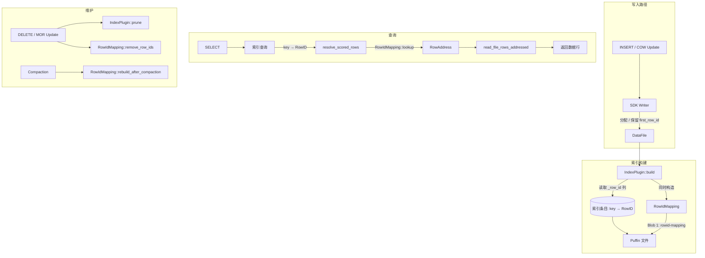

# RowID 二级索引系统 设计文档

状态：Draft
日期：2026-07-08
作者：熊磊

> **自足性约束**：本文档是 RowID 索引系统设计的完整描述。阅读者不应需要查阅实现代码才能理解设计。

---

## 1. 动机与背景

### 为什么做

Iceberg V3 引入了行级血缘（Row Lineage），通过 `_row_id` 元数据列为每行提供稳定身份：
`_row_id = data_file.first_row_id + _pos`（文件内物理偏移）。

**当前痛点**：

| 痛点 | 说明 |
|------|------|
| 物理地址不稳定 | 索引条目存储 `(file_path, row_position)`，Compaction 重写文件后全部失效，索引需要重建 |
| DELETE 产生僵尸条目 | 删除行后，索引中仍保留指向已删除行的条目，查询返回脏数据 |
| UPDATE 行身份丢失 | Iceberg 的 UPDATE 本质是 COW 重写文件——同一行只是换了物理位置，逻辑身份不变。但无 RowID 时索引无法追踪这个身份变化 |
| 每个插件自行处理地址 | 缺乏统一的 RowID→物理地址 映射，插件各自实现地址解析逻辑 |

**核心思路**：索引存储 `(key → RowID)` 替代 `(key → 物理地址)`。RowID 是逻辑行的稳定标识——文件被重写时 RowID 不变，只需更新 RowID→物理地址 的映射表。

### 为什么现在做

- iceberg-rust 0.10.0 已有 `next_row_id`、`DataFile.first_row_id()` 等基础能力
- 我们 fork 了 SDK 并完成了以下 RowID 增强（接口及所在文件）：

| 接口 | 说明 | 文件 |
|------|------|------|
| `ManifestWriter::assign_data_file_first_row_id()` | Manifest 级别为每个 DataFile 分配起始 RowID，游标推进 | `manifest/writer.rs` |
| `DataFile.first_row_id()` | 读取 DataFile 的 RowID 起点（已有字段，新增 getter） | `manifest/data_file.rs` |
| `_pos` 列输出 | Reader pipeline 在 delete filter 之后为每行追加 `_pos`（UInt64）列，值为 Parquet 文件内物理行号 | `arrow/reader/pipeline.rs` |
| `_row_id` 列输出 | Reader pipeline 追加 `_row_id`（Int64）列，值 = `firstRowId + _pos` | `arrow/reader/pipeline.rs` |
| `_row_id` 物理列写入 | ParquetWriter 检测 batch 是否包含 `_row_id` 列，有则作为物理列写入 Parquet | `writer/file_writer/parquet_writer.rs` |
| `appends_after(snapshot_id)` | 增量扫描：只返回 `snapshot_id > from_snapshot_id` 的 ManifestEntry | `scan/mod.rs` |

### 影响的系统

- **iceberg-rust SDK**：first_row_id 分配、`_pos`/`_row_id` 列读写、`_row_id` 物理列写入、增量扫描
- **iceberg-index**：所有插件改为 RowID 模式，新增 RowIdMapping 统一映射层

---

## 2. 目标与非目标

### 目标

1. 索引条目使用 RowID（稳定标识）替代物理地址（不稳定标识）
2. COW Update / Compaction 保留原 RowID（引擎在 COW 流程中读取旧文件的 `_row_id` 列并传给 SDK writer 写入新 Parquet 文件），索引条目无需变更
3. Compaction 后仅更新 RowIdMapping，索引数据免重建
4. DELETE 行后通过 prune() 清理索引中的僵尸条目，通过 `remove_row_ids()` 清理映射中的已删除 RowID
5. MOR Update（= Delete + Insert）的 Delete 部分同 DELETE 清理，Insert 部分走增量构建
6. 三种插件（BTree/IVF/IVF-PQ）统一适配 RowID 模式
7. RowIdMapping 与 index registry 存储在同一个 Puffin 文件中

### 非目标

1. **不做 FRI（Fragment Reuse Index）**：Lance 的 RowID 版本链。当前 Compaction 后通过重扫新文件重建映射
2. **不做 128-bit RowID**：当前 64-bit 足够（2^64 ≈ 1.8×10^19 行）
3. **不做多分区快照**：`SnapshotBuildPlan` 的数据结构已支持多分区（`BTreeMap<PartitionIdentity, Vec<DataFileRef>>`），仅因 PoC 阶段在入口处加了限制（`source.rs` 收到多分区快照时返回 `Error::Unsupported`）。RowID 与 RowIdMapping 不感知分区，多分区支持仅需移除该限制并补齐每个分区的 segment coverage 匹配逻辑
4. **不做无索引表的 RowIdMapping**：仅当表上存在索引时才构建和维护映射
5. **不做 Equality Delete 的 RowID 追踪**：Equality Delete 不保留原行的 `_row_id` 语义，视为删除旧行 + 插入新行
6. **不做 V2 历史 snapshot 的 RowID 回填**：V2 表没有 RowID 元数据。V3 表从创建时开始分配 RowID，历史 V2 snapshot 不支持索引查询

---

## 3. 设计概览

### Iceberg 操作对索引的影响

| 操作 | DataFile 变化 | RowID 行为 | 索引影响 |
|------|-------------|-----------|---------|
| **Append** | 新增 DataFile，旧文件保留 | 新行分配新 RowID | 旧 segment 复用；新文件走增量构建 |
| **COW Delete** | 重写受影响的 DataFile（移除已删除行） | 保留行的 RowID 不变 | 旧文件从 coverage 移除；新文件走增量构建 |
| **COW Update** | 重写受影响的 DataFile（更新行内容） | **保留原 RowID**，`_last_updated_sequence_number` 变更 | 索引条目不变（RowID 没变）；mapping 更新 RowAddress（file_path + row_position） |
| **MOR Delete** | 原 DataFile 保留，新增 Position Delete File | RowID 不变，但行被标记为不可见 | prune + remove_row_ids 清理已删除 RowID |
| **MOR Update** | Delete File + 新增 DataFile | **不保留**：旧行被 Delete File 标记 + 新行在新文件中**获得新 RowID** | 等同于 Delete + Insert |
| **Compaction** | 多个旧文件合并/拆分为新文件 | 保留行的 RowID **应不变**（物理列回写） | 索引条目不变；mapping 重建 |

RowID 保留与不保留的判断依据是"是否为同一逻辑行"：
- **COW Delete/Update/Compaction**：重写的是同一逻辑行，只是换了物理位置 → **RowID 必须保留**。这依赖引擎在 COW 流程中读取旧文件的 `_row_id` 列，将其包含在新 RecordBatch 中传递给 SDK writer 写入新 Parquet 文件
- **MOR Delete**：行还在原文件，只是新增 Delete File 标记不可见 → RowID 自然不变
- **MOR Update / INSERT**：产生的是全新的逻辑行 → 分配新 RowID

### 架构图



### 组件职责

| 组件 | 职责 | 输入 | 输出 |
|------|------|------|------|
| **SDK RowID 层** | first_row_id 分配、`_pos`/`_row_id` 列读写（双路径降级）、增量扫描 | RecordBatch + DataFile | 带 `_row_id` 列的 RecordBatch |
| **RowIdMapping** | RowID→RowAddr 映射，编码自动选择，Puffin 持久化 | `(file_path, row_id)` 流 | RowAddress |
| **IndexPlugin** | 插件契约：build/load/search/prune | IndexBuildInput / SearchRequest | CreatedIndex / IndexCandidate |
| **IndexedTableView** | 映射加载与缓存、地址解析、回表编排、快照绑定 | search result | 用户数据行 |

### 核心数据流

**写入**：SDK writer 分配/保留 RowID → 插件 build() 读取 `_row_id` 列构建索引条目 → 同时 `RowIdMapping::build()` 构建映射 → Commit 时 mapping 与 index registry 写入同一 Puffin 文件

**查询**：索引返回 RowID → `resolve_scored_rows()` → `RowIdMapping::lookup_batch()` → 批量回表

**DELETE**：DML commit 后，索引和 mapping 不会自动更新。需要外部显式调用 `maintain_index()` 才会执行 `prune()`（清理索引条目）+ `remove_row_ids()`（清理映射）。两者在同一调用中依次执行，保证同步。在 DML commit 到 `maintain_index()` 调用之间的窗口期内，索引和 mapping 均保持旧 snapshot 的状态（尚未 prune，尚未 remove_row_ids），查询旧 snapshot 的视图不受影响；新 snapshot 的视图打开时会加载新 Puffin（如已生成），或在无 Puffin 时报错

**COW Update**：引擎读取旧文件的 `_row_id` 列，传给 SDK writer 写入新文件 → RowID 不变 → 索引条目完全不变，只需 mapping 更新 RowAddress（新文件路径 + 新行位置）

**MOR Update**：等同于 Delete(旧行标记不可见) + Insert(新行，新 RowID)。Delete 部分走 prune + remove_row_ids，Insert 部分走增量构建

**Compaction**：调用方提供 Compaction 变更信息（旧文件列表 + 新文件扫描）→ `rebuild_after_compaction()`，索引条目不变

---

## 3.5 详细设计

### 核心数据结构

#### RowIdEncoding

```rust
pub enum RowIdEncoding {
    Range { first: u64, count: u64 },
    RangeWithBitmap { first: u64, count: u64, bitmap: Vec<u8> },
    SortedArray { ids: Vec<u64> },
}
```

| 场景 | 编码 | 空间 | 触发条件 |
|------|------|------|---------|
| 首次 INSERT | Range | 16B | RowID 连续 |
| DELETE 少量行（≤50%） | RangeWithBitmap | 16B + N/8B | `remove()` 自动选择 |
| DELETE 大量行（>50%） | SortedArray | N×8B | Bitmap 不再划算 |
| Compaction 后 | SortedArray | N×8B | 合并后的新文件 RowID 不连续 |

#### RowIdMapping

```rust
pub struct RowIdMapping {
    files: Vec<FileMapping>,  // 按 min_row_id 排序，支持二分查找
}

pub struct FileMapping {
    pub file_path: String,
    pub row_ids: RowIdEncoding,
}
```

**生命周期**：

| 事件 | 行为 |
|------|------|
| `from_table()` | 从 Puffin 文件加载 mapping，作为 `Arc<RowIdMapping>` 缓存在 `IndexedTableView` 中 |
| 查询 | 只读访问 `Arc`，无锁，O(log M + log N) |
| DML（DELETE/UPDATE）| `maintain_index()` → 构造新的 mapping → `remove_row_ids()` / `rebuild_after_compaction()` → 重新持久化到 Puffin。当前 `IndexedTableView` 是 snapshot 绑定的，DML 产生新 snapshot → 需要打开新 view 才能看到更新后的 mapping |
| Compaction | 同上，`rebuild_after_compaction()` |
| View 销毁 | `IndexedTableView` drop 时 `Arc` 引用计数递减，无其他引用时释放 |

**正确性保证**：

- `IndexedTableView` 绑定到特定 `snapshot_id`，打开时加载该 snapshot 对应的 Puffin 文件
- mapping 与 snapshot 一一对应，不会出现"snapshot N 的 view 读到了 snapshot N+1 的 mapping"
- mapping 为空（无 Puffin 文件或文件中无 mapping blob）时，`resolve_scored_rows()` 返回错误而非静默跳过

**持久化格式**：与 index registry 存储在同一个 Puffin 文件中：

| Blob | 类型标识 | 格式 | 内容 |
|------|---------|------|------|
| Blob 0 | `"puffin-index-registry"` | JSON | `SnapshotIndexRegistry { table_uuid, snapshot_id, indexes }` |
| Blob 1 | `"huawei.gauss-infra.rowid-mapping-v1"` | Binary LE | RowIdMapping 序列化数据 |

二进制格式（Blob 1）：
```text
[file_count: u32 LE]
for each file:
  [path_len: u32 LE][path: UTF-8]
  [encoding: u8]  0=Range, 1=SortedArray, 2=RangeWithBitmap
  if Range:        [first: u64 LE][count: u64 LE]
  if RangeBitmap:  [first: u64 LE][count: u64 LE][bmp_len: u32 LE][bitmap]
  if SortedArr:    [id_count: u32 LE][ids: u64 LE × N]
```

### 设计约束 / 不变量

| 约束 | 说明 | 违反后果 |
|------|------|---------|
| RowID 单调递增 | `next_row_id` 永不回收 | 溢出可能性极低（2^64） |
| COW Update 保留 RowID | 引擎在 COW 流程中将旧 `_row_id` 传递给 writer 写入新文件 | RowID 变化 → 索引条目批量失效 |
| 映射覆盖率 = 100% | 所有索引过的文件都必须在 mapping 中有对应条目 | lookup 返回 None → 结果丢失 |
| prune 与 remove_row_ids 同步执行 | `maintain_index()` 中先 prune 索引，再 remove_row_ids 映射，同一次调用 | 不同步 → 僵尸 RowID 或漏行 |
| `_row_id` 读取降级透明 | 物理列存在 → 直接读；不存在 → `firstRowId + position` 计算 | 两种路径结果一致 |

### 关键流程

#### RowID 类型

RowID 的 64-bit 类型来自 Iceberg SDK 定义——V3 spec 将 `_row_id` 定义为 `Int64` 元数据列（field ID = `Integer.MAX_VALUE - 107`），非索引引擎自己的选择。`RowIdMapping` 内部使用 `u64` 存储，因为 `first + count` 可能超出 i64 正数范围。SDK 输出 i64，映射内部 u64，在 little-endian 下零开销互转。

#### RowID 读取：双路径降级

1. 检查 Parquet schema 是否包含物理 `_row_id` 列 → 有则直接读取
2. 无物理列（历史数据，写入时未启用 `_row_id` 物理列写入）→ `data_file.first_row_id + _pos` 动态计算
3. 上层（索引/映射）看到的值完全一致，不感知降级

#### prune() 流程（以 BTree 为例）

1. 加载 segment（lookup table + data pages）
2. 对每个 data page：读取 `_row_id` 列，构建 keep_mask
   - keep_count == 0 → 丢弃 page
   - keep_count < n → 过滤 RecordBatch，重建 page + 更新 lookup entry
   - keep_count == n → 保持原样
3. 修改过的 segment 重新序列化并写回

#### Compaction 后映射重建

1. 调用方确定被替换的旧文件和新增的新文件（由 Compaction 引擎回调通知，或通过快照文件列表对比）
2. `rebuild_after_compaction()`: 移除旧文件条目 → 扫描新文件获取 `_row_id` → 构建新映射 → 合并并重新排序

#### COW Update：RowID 保留

1. 引擎读取旧文件时提取 `_row_id` 物理列的值
2. 引擎将旧 `_row_id` 包含在 RecordBatch 中传递给 SDK writer
3. SDK writer 检测到 `_row_id` 列后作为物理列写入新 Parquet 文件
4. 索引条目（key → RowID）完全不变，mapping 更新 RowAddress（新文件路径 + 新行位置）

---

## 4. 关键设计决策

### 决策 1：ScoredRowId 返回 + 搜索协调器层统一解析

- **选择**：插件返回 `ScoredRowId { row_id: u64, score: f32 }`（向量）或 `u64` row_id（标量）。`IndexSearchCoordinator::resolve_scored_rows()` / `ScalarSearchCoordinator::resolve_row_ids()` 通过 `RowIdMapping::lookup()` 统一解析为 `RowAddress`。mapping 中不存在的 RowID 直接丢弃
- **理由**：插件不感知 RowID→物理地址映射，`ScoredRowId` 专用于此场景，不滥用 `RowAddress`
- **代价**：多一次内存 lookup（< 1μs）

### 决策 2：remap() 移除，所有索引共享一份 RowIdMapping

- **选择**：从 `IndexPlugin` trait 删除 `remap()`。RowID 全局单调递增，同一个 RowID 在 BTree、IVF、IVF-PQ 中指向**同一行**。框架层维护一份 RowIdMapping 即可，所有插件共享
- **理由**：如果每个插件自己维护 RowID→物理地址转换，多份映射容易出现不一致。统一管理消除了这个风险
- **代价**：Compaction 后需重扫（O(文件数)），但只需做一次

### 决策 3：RangeWithBitmap 编码

- **选择**：DELETE ≤50% 行时保持 Bitmap（N/8B），避免膨胀为 SortedArray（N×8B）
- **理由**：参考 Lance `U64Segment::RangeWithBitmap`。popcount 为 CPU 指令级操作

### 决策 4：RowIdMapping 绑定 snapshot，Arc 缓存

- **选择**：`IndexedTableView` 在 `from_table()` 时一次性加载 mapping 到 `Arc`，整个 view 生命周期内只读共享
- **理由**：mapping 对应特定 snapshot。DML 产生新 snapshot → 需要新 view。`Arc` 零拷贝共享，查询路径无锁
- **代价**：多进程场景下 mapping 缓存可能过时，需靠 snapshot 版本号检测

---

## 5. 替代方案

| 方案 | 简述 | 优点 | 缺点 | 为什么拒绝 |
|------|------|------|------|-----------|
| 直接存物理地址 `(file_path, row_position)` | 无映射表 | 简单 | Compaction 后全部失效 | RowID 稳定性是核心需求 |
| remap() 保留，每个插件独立实现 | 灵活 | 无 | 代码重复，多份映射可能不一致 | RowID 全局唯一，一份映射即可 |
| RowID 128-bit | 防溢出 | 未来兼容 | 所有二进制格式需升级 | 64-bit 够用数十年 |
| FRI 增量追踪 | 参考 Lance，维护 RowID→RowID 版本链 | Compaction 开销低 | 实现极复杂 | Compaction 引擎未就绪 |

---

## 6. 接口

### 6.1 IndexPlugin trait

插件契约，每个索引类型（BTree/IVF/IVF-PQ）实现此 trait。

```rust
#[async_trait]
pub trait IndexPlugin: Send + Sync {
    /// 唯一标识，如 "huawei.gauss-infra.btree-v1"
    fn implementation(&self) -> &str;

    /// 索引种类：Scalar 或 Vector
    fn kind(&self) -> IndexKind;

    /// 校验索引定义（字段类型、参数合法性）
    fn validate_definition(&self, definition: &IndexDefinition, schema: &SchemaRef) -> Result<()>;

    /// 构建索引：读取数据 → 生成索引条目（含 _row_id）→ 写入 artifact
    async fn build(&self, context: &PluginContext, definition: &IndexDefinition,
                   input: IndexBuildInput) -> Result<CreatedIndex>;

    /// 加载已构建的 segment 到内存，用于查询
    async fn load(&self, context: &PluginContext, definition: &IndexDefinition,
                  segment: &IndexSegmentMetadata) -> Result<LoadedIndex>;

    /// 清理已删除 RowID 对应的索引条目。默认 no-op
    async fn prune(&self, context: &PluginContext, segment: &IndexSegmentMetadata,
                   deleted_row_ids: &BTreeSet<u64>) -> Result<()> { Ok(()) }
}
```

### 6.2 RowIdMapping

RowID→物理地址 映射表，在 `IndexedTableView` 初始化时从 Puffin 加载并缓存。

```rust
impl RowIdMapping {
    /// 单点查找，O(log M + log N)
    pub fn lookup(&self, row_id: u64) -> Option<RowAddress>;

    /// 批量查找，O(K log K + M)，保持输入顺序
    pub fn lookup_batch(&self, row_ids: &[u64]) -> Vec<Option<RowAddress>>;

    /// 从 (file_path, row_id) 流构建映射
    pub fn build(stream: impl Iterator<Item = (String, u64)>) -> Self;

    /// DELETE 后移除指定 RowID
    pub fn remove_row_ids(&mut self, row_ids: &BTreeSet<u64>);

    /// Compaction 后重建：移除旧文件，扫描新文件
    pub fn rebuild_after_compaction(&mut self, removed: &HashSet<String>,
                                     new: impl Iterator<Item = (String, u64)>);

    /// 序列化为 Puffin blob
    pub fn to_blob(&self) -> Vec<u8>;

    /// 从 Puffin blob 反序列化
    pub fn from_blob(data: &[u8]) -> Result<Self, String>;
}
```

### 6.3 IndexedTableView（Table 层入口）

面向用户的表级视图，绑定到某个 snapshot。

```rust
impl IndexedTableView {
    /// 打开表并加载 mapping（如有）
    pub async fn from_table(table: Arc<Table>) -> Result<Self>;

    /// 标量查询：索引 → RowID → mapping 解析 → 回表
    pub async fn search_scalar(&self, name: &str, query: ScalarSearchRequest)
        -> Result<ScalarIndexSearchResult>;

    /// 向量查询：同上，保留 score 排序
    pub async fn search_vector(&self, name: &str, query: VectorSearchRequest)
        -> Result<VectorSearchResult>;

    /// maintenance_index() 维护接口
    pub async fn maintain_index(&self, action: MaintenanceAction, ...) -> Result<()>;
}
```

---

## 7. 关键场景

### 场景 1：INSERT + 构建索引 + 查询

- **触发**：建表 → INSERT → CREATE INDEX → SELECT
- **流程**：
  1. INSERT: SDK writer 分配 first_row_id（ManifestWriter 游标推进）
  2. CREATE INDEX: `build()` 读取 `_row_id` 列 → 构建索引条目 (key → RowID) + `RowIdMapping::build()`
  3. Commit: registry (JSON) + mapping (Binary) 写入 Puffin
  4. SELECT: `from_table()` → 加载 mapping（Arc 缓存）→ 索引查询 → `resolve_scored_rows()` → `lookup_batch()` → 回表
- **预期**：查询返回正确数据

### 场景 2：DELETE + prune

- **触发**：DELETE 部分行 → `maintain_index()` → SELECT
- **流程**：
  1. DELETE: SDK 生成 position-delete 文件
  2. `maintain_index(MaintenanceAction::DeleteOnly)`:
     - 扫描 delete file → 收集 deleted_row_ids
     - `prune(deleted_row_ids)` → 清理索引 segment
     - `remove_row_ids(deleted_row_ids)` → 清理映射
  3. SELECT: 已删除行不出现在结果中
- **同步保证**：prune 和 remove_row_ids 在同一次 `maintain_index()` 调用中顺序执行。如果只 prune 而不更新映射（或反之），后续查询会出现不一致（僵尸条目 / 漏行）

### 场景 3：COW Update（RowID 保留）

- **触发**：UPDATE 一行 → SELECT
- **流程**：
  1. 引擎读取旧文件，提取 `_row_id` 物理列的值（旧行 RowID = 100）
  2. 引擎将 `_row_id = 100` 包含在 RecordBatch 中传给 SDK writer 写入新 Parquet 文件
  3. 索引条目 (key → 100) 不变，mapping 中该 RowID 对应的 RowAddress（file_path + row_position）更新为新文件的地址
- **预期**：update 后的行仍可通过旧索引条目查到

### 场景 4：Compaction + 映射重建

- **触发**：Compaction 合并小文件 → `maintain_index(MaintenanceAction::Compaction)` → SELECT
- **流程**：
  1. Compaction: 旧文件删除，新文件写入（RowID 保留）
  2. 调用方确定变更文件（Compaction 引擎回调或文件列表对比）
  3. `rebuild_after_compaction()`: 移除旧文件 → 扫描新文件 → 构建映射
  4. 索引条目不变
- **预期**：查询结果与 Compaction 前一致

---

## 8. 错误处理与降级

- **mapping blob 缺失**：有 index registry（Puffin 文件存在）但没有 RowIdMapping blob → 返回 `Error`。这不正常——有索引就必须有 mapping，否则索引返回的 RowID 无法解析为物理地址
- **mapping 文件不存在**（整个 Puffin 文件不存在）→ 表上没有索引，不会调用索引查询路径，不会触发此错误
- **lookup 单个未命中**：被查 RowID 在 mapping 中不存在 → 返回 `None`。**典型场景**：DELETE 后 mapping 更新了（`remove_row_ids` 已执行），但索引 prune 尚未完成，索引仍返回该 RowID。此时 `resolve_scored_rows()` 跳过该占位符，查询不返回该行（保守行为：宁可少返回也不返回脏数据）
- **prune 后所有 page/partition 为空**：一个 segment 中的所有行都被删除 → 该 segment 已无有效数据，直接丢弃即可（从 registry 中移除该 segment 条目）。这是正常的 DELETE 结果，不需要报错，也不需要重建索引
- **blob 格式不兼容**：`from_blob()` 返回 `Err("unknown encoding tag")`，不会静默失败

---

## 9. 测试策略

| 测试层级 | 覆盖范围 | 数量 |
|---------|---------|------|
| **RowIdMapping 单元测试** | 3 种编码策略的 round-trip、lookup、remove、rebuild、recovery、blob 序列化 | 62 |
| **BTree prune 单元测试** | 部分/全部/无删除、多页、UTF-8 key、lookup 重建 | 12 |
| **IVF prune 单元测试** | partition 过滤、全部删除跳过、向量完整性、round-trip | 7 |
| **IVF-PQ prune 单元测试** | PQ code 切片、多 partition、round-trip | 7 |
| **插件集成测试** | build + load + search（BTree/IVF/IVF-PQ） | ~40 |
| **回表测试** | read_file_rows、multi-file、address 对齐 | 17 |
| **SDK 单元测试** | first_row_id、`_pos`/`_row_id`、incremental scan | 1393 |

**总测试数**: 224（index）+ 1393（SDK） = 1617

---

## 10. 风险与未决问题

### 已知风险

| 风险 | 影响 | 缓解措施 |
|------|------|---------|
| RowID 溢出（>2^64 行） | 新 RowID 无法分配 | 监控 `next_row_id`，数十年内不可能 |
| prune 与查询并发 | 查询读到 prune 了一半的 segment | 当前无并发控制，待 Puffin 原子写入 |
| mapping 与索引不同步 | 查询漏行或返回脏数据 | `maintain_index()` 保证两者在同一事务中顺序更新 |
| mapping 缓存过时 | 多进程 prune 后其他进程缓存未刷新 | snapshot 版本号检测失效 |
| COW Update 丢失 RowID | 引擎 COW 流程未保留 `_row_id`，或 writer 未将 `_row_id` 写入物理列 | 依赖引擎正确实现 RowID 传递 + ParquetWriter 物理列写入 |

### 未决问题

当前无未决问题。

---

## 11. 与参考实现的差异

| 方面 | Lance (Rust) | 本设计 | 偏离理由 |
|------|-------------|--------|---------|
| RowID 编码 | 5 种 | 3 种 | RangeWithHoles 收益小，Array 用于乱序 UPDATE（不支持） |
| remap | FRI（RowID 版本链） | 框架层 rebuild | FRI 复杂度高，Compaction 引擎未就绪 |
| 插件 trait | 轻量（statistics/prewarm） | 重量（build/search/load/prune） | 设计阶段不同 |
| 索引类型 | 19 种 | 3 种 | MVP 阶段 |
| RowID 位数 | 128-bit | 64-bit | 当前规模足够 |

---

## 12. 相关文档

- [iceberg-index 设计文档（中文）](./design.zh-CN.md)
- [iceberg-index 设计文档（英文）](./design.md)

---

## 13. 冻结后的增量维护

本文档当前为 `Draft` 状态。进入 `Frozen` 后，所有变更走 SPEC Delta 流程。
